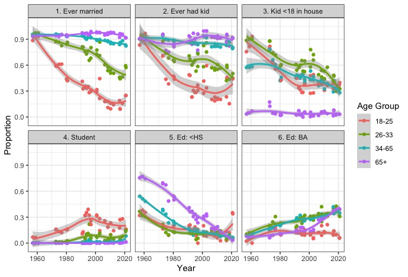
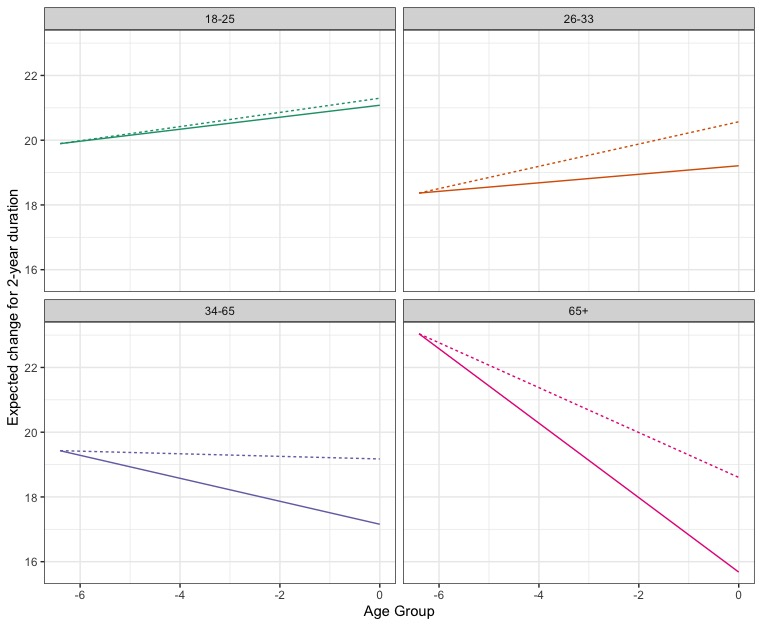
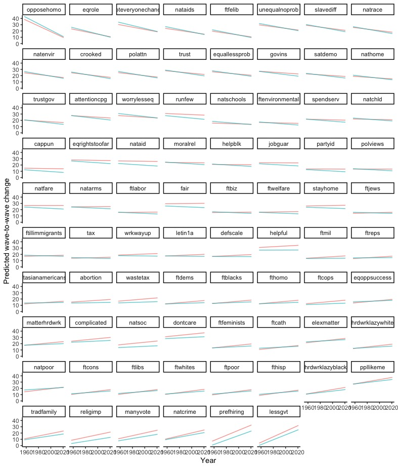

```{r setup, include=FALSE}
knitr::opts_chunk$set(echo = TRUE)
```

\doublespace

# Introduction

Adolescence and early adulthood are frequently identified in social science literature as "impressionable years" -- a stage of the life course in which people are more susceptible to broad social currents, when their opinions are more malleable, and when they form the core ideas and attitudes that shape subsequent decision making at later life stages [@krosnick1989; @alwin1991]. In support of this idea, social science research regularly finds that people in these life stages are more likely to change their political preferences, social attitudes, and cultural tastes than people in other life stages [@kiley2020; @krosnick1989], and that opinions formed in these age ranges tend to persist well into adulthood [@sears2013; @sears1999]. This pattern, in which young people show greater openness to cultural change but become more resistant over time, underpins the dynamics of cohortization that are frequently invoked in larger models of social and cultural change [@ryder1965; @mannheim1952; @voas2016].

Why people in these life stages appear to show more frequent opinion change relative to older people, however, is unclear. Social-science explanations tend to argue that the unique social features of different life stages shape whether people are open to or closed off from change during these ages. These features include high rates of mobility between social contexts, participation in educational institutions, and cultural expectations about pursuing "new experiences" in early adulthood [@alwin1991; @danigelis2007] and normative expectations around stability for middle-aged people in high-status roles [@eaton2009; @visser2004]. At the same time, interdisciplinary work on learning across the life-course finds that an early period of active exploration followed by relative stability is a broader phenomenon across organisms, which might be an evolutionary response to the tension between learning and using information in high-information environments [@gopnik2020; @frankenhuis2020; @spreng2019]. These findings suggest that the differences between early adults and the rest of the population might be more rooted in ontogenetic mechanisms than social mechanisms.

It is likely true that both social and ontogenetic mechanisms play a role in facilitating opinion change during adolescence and early adulthood, but clarifying their relative contributions is important for understanding the broader relationship between social change and cultural evolution. If the mechanisms driving heightened rates of opinion change early in adulthood are principally ontogenetic, then changes in the structure of different life stages would be unlikely to affect rates of cultural evolution. If openness to belief and opinion change in early adulthood is principally a function of the social structure of life during these ages, then delays in the timing and ubiquity of life course transitions like marriage and childbearing [@cherlin2004; @cherlin2021; @robbins2022], could shape the relative importance of within-person change and cohort effects for explaining broader cultural change [@kiley2020; @vaisey2016]. 

To better understand the mechanisms that drive openness to cultural change, we take advantage of changes in the social conditions of life stages over time. Since the 1950s, the timing of life-course transitions such as completing schooling, entering the workforce, getting married, establishing an independent household, and having children have changed dramatically, with most of these events occurring at later ages for more recent cohorts than they did for earlier cohorts [@buchmann1989; @bruckner2005]. As a result, "early adulthood" has emerged as a distinct life stage, in which people are relatively detached from family and other role obligations and have more freedom to explore ideas and lifestyles [@rosenfeld2009]. This extension of the social conditions typically thought to open people up to change should be reflected in how much people change over time. 

In this paper, we test whether these shifts in social structure have affected the rates at which people change their opinions about diverse social and political issues during early adulthood. Drawing on data for 77 questions asked multiple times across 12 panel surveys dating from the 1950s through the 2020s, we quantify broad trends in attitude change and stability over time. Consistent with the "impressionable years'' hypothesis, we find that early adults (aged 18-25 and 26-33) have more variable opinions than older respondents. However, these differences are not constant across cohorts. They emerged over the second half of the 20th Century because more recent cohorts became more stable opinion holders in middle-age than their predecessors, not because they demonstrated more opinion change in early adulthood than their predecessors.

We show that changes in the timing of life-course transitions do not appear to explain these aggregate patterns of attitude change over time. While decreased rates of marriage in early adulthood explain a small proportion of the aggregate pattern among early adults, the largest driver of change in attitude stability comes from increased levels of educational attainment across all age groups. At the same time, much of the increase in attitude stability over time remains unexplained, suggesting broader social structural features, such as increased access to information with which to form opinions or political and cultural polarization, might also be the key drivers of attitude stability. 

# Impressionable Years

The idea that the early stages of the life course are especially influential in the process of attitude formation is dominant across contemporary accounts of socialization [@dinas2014; @elder1974; @guhin2021]. These frameworks argue that the circumstances in which people are brought up leave an enduring mark on what Lizardo [-@lizardo2017] calls "personal culture" -- worldviews, attitudes, dispositions, behaviors, and preferences that manifest at the individual level. In theories of political socialization, for example, "generational effects" are used to explain the development of political preferences, longitudinal shifts in attitudes, and differences across age-groups [@gerber1998; @mannheim1952; @bartels2014]. However, the notion of "impressionable years" is more general than political preferences. The often-invoked concept of cohort effects rests on the assumption that peoples' early years play a key role in shaping a wide variety of tastes, preferences, habits, and dispositions, which then impacts their choices and life outcomes well beyond the time when this period has passed [@ryder1965; @fosse2023a; @elder2016]. Similarly, practice theories associated with Bourdieu suggest that the "past conditions of production" durably shape peoples' cognition, reactions, and behavior well into adulthood [@bourdieu1990]. Thus, the notion of a formative period at the early stages of the life-course underpins diverse and longstanding social theories of behavior.

Evidence for the impressionable years hypothesis exists at the individual and aggregate levels. At the individual level, the "impressionable years" hypothesis requires that people demonstrate opinion change early in life followed by a longer period of relative stability, especially in middle age. While different attitudes occasionally follow different patterns, this general trend has been shown to be true for political attitudes including ideology, partisan identification, interest in politics, and specific policy preferences [@krosnick1989; @alwin1991; @sears1999; @prior2010]; social attitudes around race, gender, and sexuality [@danigelis2007]; and other dispositions such as personality traits [@wagner2019] and cultural tastes [@mulder2010; @ma2021]. More generally, recent research has found that durable change of social opinion is quite rare among U.S. adults [@kiley2020]. At the aggregate level, cohort effects are consistently strong predictors of a wide variety of social and political attitudes, and Vaisey and Lizardo [-@vaisey2016] find that the year of a person's birth explains more variance in opinion differences than the year of observation for most items in the General Social Survey, suggesting an impressionable-years pattern.

In recent years, researchers have developed new approaches to quantify openness to social influence across the life course, especially around politics [@bartels2014; @ghitza2022]. This work has produced remarkably similar patterns to previous work, finding that openness peaks from a person's mid-teens through age 25 and declines quickly after that, lending more credence to the "impressionable years" hypothesis (a pattern that Way [-@way2019] suggests also holds for music tastes). However, this work tends to assume a constant age-based rate of openness across cohorts – i.e. that 20-year-olds in 1955 are open to influence at the same rate as 20-year-olds in 2015. This assumption remains untested. Regardless, there is broad evidence for a consistent pattern of malleability early in life followed by relative stability.

# Theoretical Models

While the empirical pattern of early openness followed by relative stability appears robust, its causes are not clear. Changing political, social, and cultural attitudes involve at least two distinct processes that can be difficult to disentangle in observational data: exposure to new information and change conditional on exposure to new information. For example, it could be the case that people of all ages are exposed to new ideas at similar rates, with acceptance of a new idea being a function of age, which would account for the observed age-based patterns in opinion change. Conversely, it could be the case that rates of exposure to new ideas changes over the life course, while openness to changing one's mind as a function of exposure does not, producing the same pattern. It could also be the case that both these processes change as a function of age. Because these mechanisms have not been disentangled and because there are reasons to assume that both processes are operative, in this section we outline theoretical mechanisms that have been suggested to contribute to one or both of these processes.

## Ontogenetic Mechanisms

One class of explanations for heightened rates of attitude change in early adulthood posits that attitudinal stability and change across the life course is primarily a function of humans’ cognitive architecture, which remains more or less stable across socio-historical contexts. One class theories posit that human cognition works similar to Bayesian updating, in which humans weight all information they are exposed to equally and are exposed to information at a (more or less) constant rate as they age [@bartels2014; @gopnik2020; @sherratt2018]. Because people have already encountered a lot of information by the time they reach adulthood, each new piece of information encountered later has less of an impact on their overall dispositions [@bartels2014]. From this perspective, the distinctive thing about our early years is simply that they happen early, and they prove so influential because the incremental effect of new information diminishes as we age.

A second theoretical framework suggests that development of the human mind changes across the life course and that there is something unique about human cognition during early periods that makes humans ascribe more weight to the information acquired within them than to information acquired at other points in the life course. Maturational arguments suggest that animal brains exhibit more malleability during childhood and adolescence than later in life [@mata2015, Spreng and Turner], and researchers observe evidence of this increased malleability in a wide variety of species. Younger birds, for example, are able to retool their habits in light of new information while older birds were not [@aplin2017]. Evolutionary theories posit that this pattern is a response to conditions in which environments are unstable and information is plentiful yet unreliable (Fawcett and Frankenhuis 2015; Frankenhuis and Walasek 2020; Walasek, Frankenhuis, and Panchanathan 2021), three circumstances common in human social environments. Simulations show that in these circumstances, it makes sense for agents to explore early on, to find something that works, and then to stick to strategies that have worked well in the past.

The thrust of these ontogenetic arguments is that humans have evolved a cognitive architecture that makes them relatively open to changing dispositions at younger ages and relatively resistant at older ages regardless of their contemporaneous social conditions. However, while these mechanisms can shape how humans respond to new information when they encounter it, they cannot dictate the rate at which people are exposed to new information, which is a fundamentally social process.

## Life Course and Social Roles

Humans' early years might be distinct in terms of cognitive plasticity, but they are also socially distinct. There are at least four dimensions on which early adulthood differs from other life stages in ways that could produce heightened rates of opinion change, regardless of ontogenetic factors.

First, people in these life stages tend to move across social contexts at a higher rate than people in other age groups. In the 11-year window from ages 14 to 25 in which existing work suggests people tend to show the highest rates of opinion updating, young people move from middle school to high school to either higher education or the workforce or both, with each year potentially exposing people to new classmates, teachers and other role models, and sources of information and restructuring core discussion networks [@small2015]. People in this age range also show the highest rates of geographic mobility [@geist2008]. Assuming that new social contexts shape exposure to new information, this heightened contextual mobility might explain part of the difference in attitude stability between age groups [@billari2010]. Social, contextual, and geographic mobility might also free people to adopt new opinions as they move to new contexts and are unburdened by previous friends’ or family members’ expectations. 

Second, in addition to inhabiting a greater diversity of social contexts during these years, people in adolescence and early adulthood spend their time in social contexts explicitly designed to affect attitudes and opinions. Data from the American Time Use Study shows that people under age 25 spend a larger portion of the day on leisure time and educational activities and a smaller part of the day doing work and work-related activities than people between the ages of 25 and 55. These contexts expose young adults to new information in ways that can lead to new opinions. For example, college attendance appears to change some opinions about civil liberties, politics, gender egalitarianism, racial inequality, and morality [@campbell2016; @wodtke2018; @edelmann2023; @brocic2021]. 

Third, the structure of personal social networks is distinct in this age range, with young peoples' networks tending to be larger and including more friends than kin compared to networks in middle age [@marsden1987]. Having a higher number of "weak ties" in their networks can expose younger adults to new information at higher rates [@granovetter1973; @burt2005]. And because people are less likely to adopt new beliefs if they are embedded in dense networks that reinforce the holding of existing beliefs [@stark1980], the denser, more homogenous networks that characterize middle-age [@marsden1987; @diprete2011] might make it more difficult for people in this life stage to update opinions even if they receive new information [@visser2004]. Conversely, young peoples’ less-dense networks might allow them to close off parts of their lives to people who might not be supportive of new attitudes.

Fourth, there is significant social variation in norms around when maturity is reached [@cunningham2007; @elder1994], and contemporary early adults have little cultural pressure to resemble middle-aged adults. Cultural narratives encourage exploration and self-discovery during early adulthood, pushing young adults to pursue new experiences, meet new people, and adopt new personalities during this “age of independence” [@rosenfeld2009]. These cultural expectations might also shape whether people feel capable of updating opinions in the face of new information. People appear to value stability in people holding social roles with authority [@eaton2009]. As people move into roles with more social power in mid-life, both in family and occupational contexts, they potentially feel this expectation from others and act accordingly, closing themselves off to updating beliefs even as they are exposed to new information. This potentially explains why some work finds that people appear to open up to changing their minds as they enter later life, when these social expectations of stability potentially diminish [@danigelis2007].

As the above suggests, life stages vary in myriad ways that could affect how people are exposed to new information and whether they can act on that information in ways that produce changes of opinion. As a result, changes in the duration of these life stages could have significant ramifications for how much opinion change we see in a population.

# Changing Life Course

The social and cultural conditions of early adulthood have changed considerably in the past seven decades in the United States [@buchmann1989; @rosenfeld2009; @rosenfeld2005], as expansion of higher education and increased possibility for geographic mobility have reshaped expectations around life-course trajectories [@rosenfeld2009]. While cultural norms previously encouraged marriage, stable employment, and childbearing shortly after the completion of secondary education, relaxation of these norms means that early adulthood now might involve prolonged higher education, moving to a different city, or dating without a stable romantic partner [@buchmann1989, @billari2010]. There are two related trends that are particularly important: the elongation of young adulthood and the intensification of this life stage.

## Timing

The period between adolescence and "settling down" has gotten longer over time [@billari2010]. Buchmann [-@buchmann1989] finds that young adults increasingly postpone the rituals associated with adulthood, including marriage, childbirth, and entry into the workforce. In the United States, the median age at first marriage and median age of first childbirth both occur about eight years later than they did in the mid-20th Century [@rosenfeld2009], and rates of non-marital childbearing have also increased across all demographic groups [@cherlin2021]. Thus, the markers of the transition into adulthood seem to be occurring at later ages and potentially in different orders for more recent cohorts than they did for previous cohorts.

Similarly, more recent cohorts spend more years pursuing education, with a larger proportion of the U.S. population completing high school, college, and, increasingly, graduate degrees before entering the workforce [@schofer2005]. This shift has been particularly dramatic for women, whose educational attainment and labor-force participation are much higher than 70 years ago [@england2010]. People now also move between the workforce and education at higher rates than they did in the past [@rosenfeld2009].

If the heightened rates of attitude change during peoples’ "impressionable years" is principally driven by the distinct social circumstances of adolescence and early adulthood, then the delay of full adulthood has the potential to extend these social circumstances into later ages, extending heightened rates of attitude change later in the life course. While people born in the mid-20th century might have displayed mainly opinion stability by the time they reached their mid-twenties, when they married and had children, people from more contemporary cohorts, unmarried and childless at the same ages, might show higher rates of opinion change. Specifically, we expect cohorts who entered adulthood in the late 1950s to be fairly comparable to contemporaneous middle-aged adults in their rates of attitude change, but that these age groups will diverge in their rates of change in more recent years. This leads us to our first hypothesis:

*Hypothesis 1: More recent cohorts will show higher rates of opinion change in the age range of 18 to 25 than cohorts born in earlier years.*

We focus on people 18 to 25 for two reasons. First, existing work has explored attitude stability and change among people in this age range in earlier cohorts [@krosnick1991; @alwin1991], providing a baseline for what to expect. Second, this group has seen the most significant change in life course transitions of all age groups. Whereas most people in earlier cohorts were married with children by the midpoint of this age range, the median age of marriage and first childbirth is now outside this group for both men and women. We expect a similar but more muted trajectory for attitude behavior of people aged 25-33. Again, we expect the oldest cohorts to resemble middle-aged respondents when they enter this age range, as has been shown in previous research, but that more recent cohorts will come to more closely resemble the 18-25 age group. This produces our second hypothesis:

*Hypothesis 2: More recent cohorts will show higher rates of attitude change in the age range of 26 to 33 than cohorts born in earlier years.*

If these differences are principally driven by the structure of the life course at these stages, then we would expect that, controlling for these life-course transitions, the gap between early adults and older adults will disappear. This leads to our third hypothesis:

*Hypothesis 3: Controlling for rates of marriage, childbirth, and having a child at home, more recent cohorts' rates of attitude change in early adulthood (18-33) will not be different from the rates of attitude change among contemporaneous middle aged adults.*

## Intensifying Impressionable Years

Rosenfeld [-@rosenfeld2009] argues that one of the processes underlying the rapid rise in same-sex and interracial marriages is that young adults have increasingly escaped their parents’ authority. When a young person lives with, or is financially dependent on, his or her parents, the latter have more say about their child's choice of partner. Social and cultural changes that have increased geographic mobility and independence from parental authority mean people in this life stage have been able to engage in courtship outside the gaze of their parents, making choices that would not have been sanctioned by them.

This work suggests that increased independence might enable greater exploration and freedom to update attitudes beyond that facilitated life-course transitions. This framework suggests that freedom of exploration is not just dependent on life-course roles (marriage, parenthood, etc.) but also influenced by broader cultural expectations. In other words, married 25-year-old men and women in 1956 might have experienced an additional set of social constraints that married 25-year-old men and women in 2016 do not experience, leaving the latter much more open to developing new opinions. The "intensification" of impressionable years suggests a fourth hypothesis that challenges the third:

*Hypothesis 4: Controlling for life course transitions, more recent cohorts of early adults (18-33) will still make higher rates of attitude change than contemporaneous middle-aged adults.*

## Broader Social Factors

We have focused primarily on changes in the timing and structure of early adulthood over the past 70 years, but that time frame has also seen significant shifts in the broader social and cultural environment that might affect attitude stability independent of changes in life course structure. 

First, the number of people completing high school and pursuing higher levels of education increased significantly during the 20th and early 21st Centuries [@schofer2005; @hout2012]. Existing work suggests that people with higher levels of education are more likely to express the same opinion over time in survey contexts [@alwin1991a; @alwin2007]. The specific mechanism that links educational attainment and attitude stability is unclear, with some perspectives suggesting educational attainment improves cognitive function and memory while other perspectives suggest that educational attainment makes people pay more attention to current events. It could also be the case that education cultivates in people a normative expectation that they should hold stable opinions. Regardless of the specific mechanism, people with higher levels of education might be more likely to hold stable opinions regardless of where they are in the life course, and differences in educational attainment across age groups could produce differences in attitude stability. This leads to our fifth hypothesis:

*Hypothesis 5: Cohorts with higher levels of education will demonstrate higher levels of attitude stability at all age ranges.*

Second, technological changes have dramatically lowered barriers to accessing information, including information about social and political affairs that might facilitate stable opinion holding. Broadcast and cable television, followed by the internet and social media, have provided new channels for elites to communicate messages to the public and for people to acquire information that makes stable opinion holding easier. To the extent that stable opinions are in part a reflection of signals from elites [@converse1964; @zaller1992], then we should expect these shifts to stabilize opinions across all age ranges.

Third, the past 70 years have seen elite polarization around political and social affairs, as well broader public partisan realignment [@fiorina2008; @baldassarri2008]. People now receive clearer signals from cultural elites, including politicians, the news media, and others, about which beliefs and identities "go together" in the population, resulting in what DellaPosta [-@dellaposta2020] calls an "oil spill" of polarization. While clarity around political issue positions is most commonly studied, the same forces can also align other social beliefs and identities. Geographic and social sorting into lifestyle "enclaves" also reinforce these processes, continually providing clearer signals about which opinions people should hold [@dellaposta2015]. This issue and identity alignment might make it easier for the public to identify what beliefs people like them "should" hold and hold them consistently [@zaller1992]. 

Broadly speaking, these forces suggest that all age groups’ opinions will be more stable in successive cohorts, regardless of life-course stages. If this is the case, we might not observe an absolute decrease in stability for early adults, but rather a relative decrease, as extension of the life course works to decrease stability for members of these age groups while broader social forces stabilize opinions for all groups. This produces our final hypothesis:

*Hypothesis 6: At all ages, more recent cohorts will demonstrate higher levels of attitude stability, controlling for educational attainment and life-course transitions, than earlier cohorts.*

We have outlined hypotheses derived from the theoretical model that suggests that social conditions are the key driver of higher rates of attitude change among early adults and adolescents. To the extent that we observe significant changes in the social context of early adulthood but no corresponding changes in rates of attitude change or response stability across cohorts, we would take this as evidence that social circumstances play a relatively small role in explaining rates of attitude change compared to ontogenetic factors. 

# Analytical Strategy

Our hypotheses can be adjudicated with a set of theoretical estimands [@lundberg2021]. Our comparisons suggest a set of theoretical estimands regarding the difference in opinion change for Americans in the same age range born in different cohorts. We seek to compare the average amount of opinion change we observe for a particular cohort during a particular age range to the average amount of opinion change for a cohort born 10 years later, conditional on age range. To be clear, we do not seek to estimate this quantity assuming only the year someone was born is different and holding all other factors constant. It is impossible to separate out the age at which people of a certain cohort answer questions from the year in which they answer them [@fosse2019]. Cohorts also differ in other ways, including size and demographic composition, that might be relevant for explaining differences in the rates of change they demonstrate. This set of theoretical estimands is principally descriptive, with variation in the social experiences of people in successive cohorts and even the demographic composition of the cohort itself being potential explanations for whatever gaps we observe.

\begin{equation*}
 \begin{aligned}
  \tau_1 = \frac{1}{n}\sum_{c=1}(Y_{c}-Y_{c+10})
 \end{aligned}
 \end{equation*}

In this theoretical estimand, $Y_{c,a}$ captures the expected amount of change in responses for a cohort at age range $a$, and $Y_{c+10,a}$ captures the expected amount of change in responses for a cohort born 10 years later at the same age range, with a fixed duration between observations. We seek to average the quantity across cohorts captured in panel surveys from the 1950s onward. 

Our second set of theoretical estimands captures how differences in the rate of change between age groups itself changes over time, specifically whether the gap between how much early adults (either 18-25 or 26-33) change over time and how much middle-aged adults (34-64) change over time itself is different in different years. Again, we do not assume that the composition of any age group is fixed, nor that later cohorts experience the same social environment as earlier cohorts.

\begin{equation*}
 \begin{aligned}
   \tau_2 = \frac{1}{n}\sum_{t=1}([Y_{t,\text{ma}} - Y_{{t},\text{ea}}] - [Y_{{t-10},\text{ma}} - Y_{{t-10},\text{ea}}])
 \end{aligned}
 \end{equation*}

In this estimand, $Y_{t,\text{ea}}$ reflect the average change in responses for early adults at a particular time $t$ and $Y_{t,\text{ma}}$ reflects the average change in responses for middle aged respondents at the same time. $Y_{t,\text{ea}}$ and $Y_{{t-10},\text{ea}}])$ reflect these same rates observed in the population 10 years earlier. In contrast to the previous estimand, this estimand is indexed by t, or time in years, not cohort, and we average over all times captured since the late 1950s.
Finally, hypotheses 3, 4, 5, and 6, imply theoretical estimands reflecting the difference between cohorts as they pass through the same age range, conditional on cohorts having the same levels of certain demographic characteristics. Specifically, they focus on whether differences in life course transitions and educational attainment mediate the observed differences between cohorts at different time points. 

\begin{equation*}
 \begin{aligned}
   \tau_3(e,l) = \frac{1}{n}\sum_{c=1}(Y_{c,a}(E=e,L=l)-Y_{c+10,a}(E=e,L=l))
 \end{aligned}
 \end{equation*}

This framework repeats that of $\tau_1$, comparing a focal cohort to the cohort that came 10 years later, while holding both cohorts’ levels of educational attainment, $E=e$, and life course transition rates, $L=l$ to the level of the earlier cohort. We again average this difference across all cohorts observed since the late-1950s. In comparison to $\tau_1$ and $\tau_2$, however, this estimand requires a counterfactual component that is not directly observed. 

## Data

Generating empirical estimands for these theoretical estimands requires data on opinion and attitude reports over time for members of different cohorts in the same age ranges, with respondents coming from the same general population. We also require information about life-course transitions standardized across panels. To construct such a data source, we combine panel surveys conducted by the American National Election Studies (ANES) and the General Social Survey (GSS) spanning about 60 years. Both the ANES and GSS are designed to generalize to the non-institutionalized U.S. adult (18+) population, and therefore can be thought of as tapping the same general population. We included 12 panels in our final dataset: ANES panels from 1956-60, 1972-76, 1980, 1990-92, 1992-97, 2000-04, 2016-20, and 2020-22; and GSS panels from 2006-10, 2008-12, 2010-14, and 2016-20. 

For reasons related to our modeling strategy explained below, we identified social and political attitude questions asked in at least three different panels with at least one of those panels asking respondents to answer the question at three or more time points. Questions had to ask respondents to report their own opinions, not the positions or opinions of others. Because the GSS panels overlap considerably (2006-10, 2008-12, and 2010-14) and contain the same questions, we did not treat these as separate panels for the purposes of identifying three distinct time points. Questions needed to appear in these panels and an ANES panel to be included in our analysis. We allowed for question wording to vary slightly across panels (e.g., feeling thermometers about the "women's liberation movement" were combined with feeling thermometers about the "women's movement"). When similar questions had different response scales, we harmonized response options to the question structure with the fewest response options. This was most common when one panel asked whether people agreed or disagreed while another included options for "strong" agreement and disagreement. We followed the ANES time series Cumulative Data File codebook in deciding which questions to harmonize.

Our search produced a total of 77 questions tapping political and ideological identification, general government policy preferences, preferences for federal spending on different priorities, views of government efficacy and trust in government, views on social issues and social change, and sentiment toward various political and social groups. For reasons elaborated below, we scaled items to have a minimum of 0 and a maximum of 100. Table A1 in Appendix A outlines the questions included in our analyses, including their full question wording, number of waves and panels, and response scales.

### Opinion Change

Our outcome of interest is the amount of change in a person’s responses across two instances of being asked the same question, meaning our unit of analysis is a pair of waves by the same person, rather than a single observation or a single person. If a person responds to a question K times in a panel, he or she will have $(K*(K-1))/2$ observations for that item in our data set. Because we are unconcerned with the direction of change between responses, we take the absolute value of the difference between each two observations of a person’s response to the same question. Because all questions are scaled between 0 and 100, this takes on a value between 0 and 100. 

### Demographic Measures

The central questions in our analysis pertain to age, cohort, and the time of the interview. All surveys included the date when the survey interview took place.[^1] Age was reported at least once in all panels. If respondents' were not asked their age or birth date in a specific wave, we calculated it based on other age reports and the date of the interview. We classify respondents into a set of age brackets depending on their age when they answered the survey questions: 18-25, 26-33, 34-64, and 64-80. Because of differences in the wording of age questions across panels, we dropped respondents who were older than 80 in the first observation of a wave pair. 

[^1]: In the rare cases that a survey interview for a single wave of the survey occurred on two distinct days, we classified the date according to the day the interview started.

Our second set of theoretical questions focuses on the relationship between life-course transitions and attitude change. Questions tapping marital status, student status, and degree attainment were asked in similar ways and could be easily harmonized. We generated indicator variables capturing whether the respondent is currently enrolled in school and has ever been married. We also include indicators for whether a respondent reported completing college or did not complete high school. It was common for respondents to have missing data on one or more of these demographic variables for a particular wave of any panel, even if they participated in the wave. This was most common when a question was asked in the pre-election wave of the ANES but not in the post-election wave. When this occurred, we carried over the pre-election response, as these waves tended to be separated by only a few weeks. If these questions were missing from a wave and someone had previously reported ever being married or ever having a child, we carried over that report to subsequent waves. If their status at the time of an interview was unclear, we coded the response as missing.

Generating an indicator for whether a respondent ever had a child was more challenging, as question wording and structure varied across panels. Some waves asked respondents how many children were currently living with them while others asked whether the respondent had any children and how many. To account for this, we generated two variables. We created an indicator variable for whether a respondent reported having at least one child in the house under 18. Respondents who were not asked the question in a wave (or temporally proximate wave) were coded as missing. Second, we gave respondents an indicator for whether they had ever had a child. We coded this as 1 if respondents were asked if they ever had a child and reported that they did or if they were asked if they had a child living with them and reported that they did. We coded this as 0 if respondents were asked whether they ever had a child and said no. Respondents were coded as missing if they were asked how many children under 18 they had living with them and said none, or if they were not asked either relevant question in a particular wave or temporally proximate wave.

We imputed missing demographic data for respondents using multiple imputation with chained equations. Multiple imputation approaches the question of missing data as one of prediction. It uses existing relationships in the data to create a predicted value for missing data, which is consistent with the patterns in the data. But it recognizes that there is uncertainty in these predictions, so it iterates over this process several times. Different imputed values reflect uncertainty in the predictions that can be drawn from relationships in the data. In the analysis stage, all predicted values are used to incorporate the uncertainty in the imputed values. We used other demographic variables as well as attitude difference reports to impute missing values, though no outcomes were imputed this way. We also included sex (male or female) and race (white, black, or other), both recorded in all waves, as predictors in these imputation equations. We created a set of 5 different imputed datasets to acknowledge uncertainty in this process, and our final analyses are conducted across all imputed datasets. 

## Methods

When questions are observed in multiple panels, differences in the amount of change we observe could be attributable to either changes in overall attitude stability (our main theoretical interest) or to the structural features of the survey. Centrally, the amount of change people make in their responses over time is likely affected by the duration of time between responses, with longer duration between responses leading to more wave-to-wave change as people experience more shocks that could shift their opinions. In our data, panel duration varied from less than one year (the 1980 ANES Major Panel Study) to about five years (the 1992-97 ANES), and duration between questions ranged from a few days (for questions asked in both pre- and post-election surveys in the ANES panels) to about five years (questions asked in 1992 and 1997), with peaks around 2 years and 4 years. Accounting for these differences is a key part of our analytical approach.

Consider a one-item, one-panel case (e.g., partisan identification in the 1972-76 panel). We model the absolute change between two responses to the same question by the same person as a function of an intercept and the duration between observations in years. In this equation, $i$ indexes a pair of observations, not a person.

\begin{equation*}
 \begin{aligned}
   |y_{2i}-y_{1i} | = \beta_0 + \beta_1*d_i + \epsilon_i
 \end{aligned}
 \end{equation*}

In this equation, $d_{i}$ captures the duration of time between $t_1$ and $t_2$ in years for each pair of observations by the same respondent. Importantly, respondents might have multiple observation pairs for each panel depending on the number of times they answered a question. In the 1972-76 ANES panel respondents were asked their partisan identification on three occasions: in the 1972 pre-election survey, in the 1974 pre-election survey, and the 1976 pre-election survey, each about two years apart. If a person participates in all three waves, they would have three observations of $|y_{2i}-y_{1i} |$ and $d_i$: 1972 and 1974 (about 2 years), 1974 and 1976 (about 2 years), and 1972 and 1976 (about 4 years).

Variation in duration between observations within panels lets us separate two kinds of change: 1) change that is principally random, or unrelated to the duration between observations, captured in $\beta_0$, and 2) change associated with duration between observations, captured in $\beta_1$. If respondents have a stable underlying partisan identification they report with random error and no real change occurs between waves beyond that, duration should be unrelated to absolute change in responses over time in expectation, and $E(\beta_1) = 0$. If a respondent shifts from "strong Democrat" (point 0 on the scale) to "Independent" (point 3 on the scale) between 1972 and 1974, and stays at "Independent" for the 1976 wave, they will have differences of 3 and 0 for the two-year duration (an average of 1.5) and 3 for the four-year duration, generating a positive coefficient for $\beta_1$.

Given our focus on age-based differences, we extend this equation to incorporate age groups as predictors of absolute difference:

\begin{equation*}
 \begin{aligned}
   |y_{2i}-y_{1i} | = \beta_0 + \beta_1*d_i + \beta_2(a_{26-33}) + \beta_3(a_{34-64}) + \beta_4(a_{65+}) + \\
   \beta_5(d*a_{26-33}) + \beta_6(d*a_{34-64}) + \beta_7(d*a_{65+}) + \epsilon_i
 \end{aligned}
 \end{equation*}

In this framework, $\beta_0$ and $beta_1$ now capture the expected change in responses that is unrelated to time and each additional year, respectively, for respondents ages 18-25 (the reference category). $\beta_2$ through $\beta_4$ capture the difference in baseline change between observations for the older groups and $\beta_5$ through $\beta_7$ capture differences in the effect of an additional year duration for the older age groups.

Our theoretical questions deal primarily with whether these relationships change over time and whether differences between groups change across the broader time span captured across panels. To explore whether the rate of change changes over time, we add an additional term for time (in decades) and interact all previous coefficients outlined above with time.

\begin{equation*}
 \begin{aligned}
   |y_{2i}-y_{1i} | = \beta_0 + \beta_1(d) + \beta_2(a_{26-33}) + \beta_3(a_{34-64}) + \beta_4(a_{65+}) + \\ 
   \beta_5(d*a_{26-33}) + \beta_6(d*a_{34-64}) + \beta_7(d*a_{65+}) + \\
   \beta_8(t) + \beta_9(d*t) + \\
   \beta_{10}(a_{26-33}*t) + \beta_{11}(a_{34-64}*t) + \beta_{12}(a_{65+}*t) + \\
   \beta_{13}(d*a_{26-33}*t) + \beta_{14}(d*a_{34-64}*t) + \beta_{15}(d*a_{65+}*t) + \\
   \epsilon_i
 \end{aligned}
 \end{equation*}

In this formulation, $\beta_0$ through $\beta_7$ retain their general meaning as outlined above, but apply to $t = 0$, which we set to be the most recent observation date (2020). $\beta_8$ estimates the change in the baseline rate of change for the reference group. $\beta_9$ captures change in the effect of duration of observation over time for people in the reference group (ages 18-25). Coefficients $\beta_{10}$ through $\beta_{12}$ and $beta_{13}$ capture how differences in the baseline rate of change and duration effects between the reference group and older age categories change over time.[^2]

[^2]: We index time by the year of observation in decades, but it would be functionally similar to index time by cohort. 

To this point, we have developed our model for the case of a single question. While a small number of questions are asked in almost every panel, most are only asked in a few panels. As such, separate estimates of time trends for all items are likely to have a low degree of reliability. One solution is to pool questions and estimate a single time trend for stability in attitudes over time. That approach is potentially problematic if the kinds of questions asked in later panels are systematically different from the kinds of questions asked in earlier panels. It could also obscure the fact that some items might be becoming more stable over time while others are becoming less stable. Multilevel models [@gelman2007; @raudenbush2002] provide an alternative solution to estimate variation in time trends in the presence of uncertainty. We follow this approach, using the model:

\begin{equation*}
 \begin{aligned}
   |y_{2ij}-y_{1ij} | = \beta_{0j} + \beta_{1j}(d) + \beta_{2j}(a_{26-33}) + \beta_{3j}(a_{34-64}) + \beta_{4j}(a_{65+}) + \\ 
   \beta_{5j}(d*a_{26-33}) + \beta_{6j}(d*a_{34-64}) + \beta_{7j}(d*a_{65+}) + \\
   \beta_{8j}(t) + \beta_{9j}(d*t) + \\
   \beta_{10j}(a_{26-33}*t) + \beta_{11j}(a_{34-64}*t) + \beta_{12j}(a_{65+}*t) + \\
   \beta_{13j}(d*a_{26-33}*t) + \beta_{14j}(d*a_{34-64}*t) + \beta_{15j}(d*a_{65+}*t) + \\
   \epsilon_i
 \end{aligned}
 \end{equation*}

Where:

$$ \beta_{kj} = \gamma_k + \upsilon_{kj} $$

$$ \gamma_k \sim \mathcal{N}(0,\sigma_{\gamma_k}^2) $$

$$ \epsilon_i \sim \mathcal{N}(0,\sigma_{\epsilon}^2) $$

In this framework, the first-level equation models the absolute difference in a pair of responses to the same question given by the same respondent, similar to what was presented above. These equations are nested at the level of the survey item. This approach produces an aggregate estimate for each coefficient across all questions ($\gamma_k$) while accounting for variation in which questions are asked at different time points. It also allows for each survey question to have its own set of coefficient estimates weighted by the amount of information we have about the particular question. Questions asked in many panels, including partisan identification (asked in a total of 32 waves across all panels) and ideological identification (asked in a total of 28 waves across all but one panel), will contribute more to the overall calculation of the aggregate trend in opinion stability and age differences than a question asked in only three panels. Given the lack of confidence in each individual question’s estimates, we focus the majority of our attention on $\gamma_k$ estimates.

The full model outlined above is likely too complicated given our data limitations, and some interaction terms or random effects might not be necessary if certain effects or differences are constant over time, do not vary by age group, or are similar across questions. For example, it could be the case that little predictive information is gained by allowing questions to have separate slopes for the relationship between age categories and duration over time. We compare the fully elaborated model to more parsimonious models using model-selection criteria, specifically the Bayesian information criterion (BIC) and Akaike information criterion (AIC) [@raftery1995].

Coefficients generated in this model can be used to provide empirical estimates of our theoretical estimands. In this framework, $\gamma_{8}$ estimates the expected difference in absolute change for someone ages 18-25 born in a particular year and someone born 10 years earlier at the same age bracket, providing a quantification of $\tau_1$. Similarly, $gamma_{11}$ captures the change in the difference between the youngest age group (18-25) and the middle age group (34-64) for a 10-year difference in time, providing a quantification of $\tau_2$.

Once we select the best-fitting model to capture trends in attitude change over time, we add variables capturing demographic transitions and educational attainment. For each wave pair, we include measures of demographic status at the first observation for a pair of observations.[^3] 

[^3]: For example, if a respondent got married between waves, they are counted as “never married” for that pair of observations, since they are unmarried at time 1. If they are observed a third time, they would be counted as having ever been married. 

\begin{equation*}
 \begin{aligned}
   |y_{2ij}-y_{1ij} | = \beta_{0j} + \beta_{1j}(d) + \beta_{2j}(a_{26-33}) + … + \beta_{15j}(d*a_{65+}*t) + \\ 
   \beta_{15j}(d*a_{65+}*t) + \beta_{16j}(evermarried) + \beta_{17j}(everkid) + \\
   \beta_{18j}(kidinhome) + \beta_{19j}(student) + \beta_{20j}(<HS) + \\
   \beta_{21j}(BA) + \epsilon_i
 \end{aligned}
 \end{equation*}

These variables are all centered at their grand means, and like coefficients for age group, time, and duration, are allowed to vary by question. Coefficients produced in this model allow us to generate an estimate of $\tau_3$, or what a cohort would look like if we set their rates of marriage, parental status, and educational attainment to that of another cohort. 

Most panels include weights that account for differential sampling and panel attrition. When available, we use panel weights that ensure that the second wave of the pair of observations is reweighted to make the sample representative of the general population. The 1980 Major Panel Study does not include weights, and as such all respondents in that panel are weighted equally.

# Results

## Life Course Changes

Figure 1 plots the proportion of respondents who are married, who reported ever having a child, who reported having a child at home, and who are currently students for each panel wave included in our aggregate data set. Figure 1 also includes the proportion of respondents at two education levels: those with less than a high school education and those with a college degree (with the remaining population being those with a high school degree but nothing more).

```{=latex}
\begin{figure}[]
\begin{center}
\caption{Proportion of respondents in different age categories reporting life course milestones or levels of educational attainment, by panel wave.}
```
```{r demogs, out.width = "100%", fig.pos = "H", echo = FALSE}

```
```{=latex}
\end{center}
\footnotesize{\textit{Notes: Proportions calculated using imputed data.} }
\end{figure}
```

In the 1956-60 ANES panel, respondents in the youngest age groups are equally likely to be married, to have had children, and to be students as middle-aged respondents. At the same time, despite being younger, respondents in the 18-25 and 26-33 age groups had higher levels of educational attainment, on average, than their older peers, indicated by a lower proportion having less than a higher school degree (meaning more had a high school degree). People in the 18-25 age group diverged from the others by the 1970s, displaying a lower probability of being married and lower probability of having children, a trend that continues through the most recent panels. The next youngest age group (26-33) also diverged from the middle age group, especially in their rates of marriage and having children, but did so more slowly.

Figure 1 also shows an increase in the proportion of middle age and older age groups who complete high school and college. By the mid-1990s, the proportion of middle aged and older respondents who had college degrees significantly exceeded the proportion of the youngest age group who had college degrees, likely because many people aged 18-25 were still completing education.

These trends set the stage for what to expect in terms of opinion change for different age groups. If marriage and having children serve as proxies for broader life course factors that influence opinion stability, we should see the youngest age group look similar to the older age groups in the 1950s. We then would expect this younger group to diverge from older groups in terms of attitudinal stability as time passes. Respondents in the 26-33 age group should also start similar to middle-aged respondents and diverge, albeit more slowly. To the extent that educational attainment is related to attitude stability, we should observe increased attitude stability among all groups, but especially among middle aged and older respondents who have seen the most dramatic increases in educational attainment.

## Opinion Changes

Comparing the fully elaborated model outlined above to more parsimonious models, the best-fitting model, according to the BIC, allows random effects for duration, time, and age group, but does not allow them for higher-order interactions. This model also omits the three-way interactions between time, duration of observation, and age groups. Further attempts to simplify the model, including dropping two-way interactions or random effects for age categories and duration, resulted in increases in the BIC. 

Model 1 in Table 1 presents the main effects and variance components of the best-fitting multilevel model presented above. In all models, the 18-25 age group serves as the reference category, and the time variable is centered on the most recent wave pair (starting in 2020), so coefficients reflect expectations for the amount of change observed in the most recent years, rather than at earlier time points.

\pagebreak

|                         | Model 1      | Model 2      |
|-------------------------|--------------|--------------|
| **Fixed Effects**       |              |              |
| Intercept               | 17.77 (0.75) | 17.46 (0.77) |
| Time (decade)           | -0.01 (0.17) | -0.15 (0.17) |
| Age(26-33)              | -0.94 (0.35) | 0.42 (0.35)  |
| Age(34-64)              | -2.49 (0.37) | -0.82 (0.36) |
| Age(65+)                | -3.39 (0.48) | -1.70 (0.44) |
| Duration (year)         | 1.45 (0.10)  | 1.56 (0.10)  |
| Time\*Age(26-33)        | -0.02 (0.07) | 0.18 (0.07)  |
| Time\*Age(34-64)        | -0.51 (0.06) | -0.15 (0.06) |
| Time\*Age(65+)          | -1.38 (0.07) | -0.80 (0.07) |
| Duration\*Age(26-33)    | -0.17 (0.09) | -0.28 (0.08) |
| Duration\*Age(34-64)    | -0.38 (0.08) | -0.49 (0.07) |
| Duration\*Age(65+)      | -0.51 (0.02) | -0.58 (0.09) |
| Duration\*Time          | 0.14 (0.02)  | 0.15 (0.02)  |
| Ever married            |              | -0.89 (0.21) |
| Ever had child          |              | 0.26 (0.14)  |
| Child under 18 in house |              | 0.30 (0.10)  |
| Student                 |              | -0.57 (0.24) |
| Less than HS            |              | 2.80 (0.35)  |
| College degree          |              | -2.42 (0.24) |
|                         |              |              |
| **Random Effects**      | **S.D.**     | **S.D.**     |
| Intercept               | 5.99         | 6.24         |
| Time                    | 1.32         | 1.31         |
| Duration                | 0.50         | 0.50         |
| Age(26-33)              | 1.42         | 1.32         |
| Age(34-64)              | 2.26         | 1.99         |
| Age(64+)                | 3.06         | 2.41         |
| Ever married            |              | 1.60         |
| Ever had child          |              | 0.88         |
| Child under 18 in house |              | 0.67         |
| Student                 |              | 1.72         |
| Less than HS            |              | 1.04         |
| College degree          |              | 2.98         |

: Coefficient estimates from multilevel linear regressions of absolute change between responses on age group, duration, and question.

The intercept term in Model 1 suggests that, on average, survey respondents in the 18-25 age group are expected to change by almost a fifth of the response scale on average (about 18 points) in the most recent years of the survey on any particular question, regardless of the duration between observations. To be clear, very few wave pairs have a duration close to 0, and this coefficient primarily reflects the fact that this amount of absolute change will be present regardless of whether responses are 2 or 4 years apart. This high level of change is consistent with previous studies that find that survey respondents tend to make large, seemingly random, wave-to-wave changes [@ansolabehere2008; @converse1964]. At the same time, random-effect variance around this intercept term is large ($\sigma_{\beta_0} = 5.99$). On several questions, respondents are expected to change their responses by about 40 percent of the scale between observations, while on others people tend to respond with the same answer over time with low levels of measurement error or random change.

Duration between observations is positively associated with wave-to-wave absolute change for the youngest age group (duration coefficient = 1.45), and while the interaction between duration and age group is negative for older age groups, duration is still positively related to the amount of change for all. Random effect variance around this main effect of duration is relatively small (s.d. = 0.50), meaning each one-year duration only increases the amount changed by between .5 and 1.5 for most questions, and it is never negatively associated with change. Given the high level of wave-to-wave change independent of duration, our results reinforce long-standing findings that most wave-to-wave change is non-persisting or measurement error [@converse1964; @zaller1992; @kiley2020; @lersch2023].

The coefficients for age groups other than the reference category suggest that, on average, older age groups are more stable than people in the 18-25 range in the most recent panels. In these panels, respondents in the 26-33 age group are about 1 point more stable on average, respondents in the 34-65 age group are about 2.5 points more stable on average, and respondents in the 65 and over age group are about 3.4 points more stable on average, than respondents in the 18-25 age group. The negative coefficients attached to the interactions between duration and age categories further compound this difference, as longer durations produce more change among the younger respondents than older respondents. This provides broad evidence for the "impressionable years" hypothesis, with the youngest age group being more likely to change than others, followed by the 26-33 age group.

Turning now to how these groups have changed over time, the coefficient for time in decades for people in the 18-25 age group ($\gamma = -0.01$, $t = 0.75$) is substantively small and not statistically significantly different from 0. Question-level random effects vary considerably around this main effect, with a standard deviation of about 1.43, meaning the overall flat trend obscures large question-level differences, with responses to some questions becoming more stable and responses to others becoming less stable. We consider these question-specific trends later. It is important to note that because the effect of duration also increased over time (duration*time coefficient = 0.14), the most recent cohorts to pass into the 18-25 age range are expected to make slightly more change over time in recent years, on average, than previous cohorts did when they were in this age range, but the trend is not pronounced. 
The extended early adulthood framework hypothesized that the 26-33 age group would come to resemble the youngest age group over time. The interaction between year of observation and the 26-33 age category is small and not statistically significant ($\gamma = -0.02$), suggesting that while people in this age group are more stable, on average, than the youngest respondents, more recent cohorts are not any more or less likely to make changes of opinion in this age range than earlier cohorts and not any more or less similar to the youngest adults (18 to 25) than earlier cohorts.

Before concluding that this stability of rates of attitude change across cohorts of early adults reflects a lack of importance of life course shifts, it is important to understand the full picture of change over time. Model 1 shows that, in contrast to people in the 18-25 and 26-33 age ranges, whose rate of opinion change was relatively stable across cohorts, older age groups (34-64 and 65+) show a notable negative time trend across cohorts. Both time trends are negative, substantively large (-0.5/decade for middle age and -1.3 for old age), and statistically significant, meaning more recent cohorts are more stable opinion reporters while in these age ranges than earlier cohorts were. To more clearly illustrate these trends, Figure 2 plots the overall predicted level of change for respondents in each age category over time, assuming a two-year duration between observations (the modal duration between waves). It also includes separate trajectories for each individual question to highlight variation in the trajectories across these items for the different age groups.

```{=latex}
\begin{figure}[]
\begin{center}
\caption{Predicted absolute wave-to-wave change over time for respondents in different age categories.}
```
```{r grouptrend, out.width = "100%", fig.pos = "H", echo = FALSE}
knitr::include_graphics("../figures/trajectory_plot.jpeg")
```
```{=latex}
\end{center}
\footnotesize{\textit{Notes: Bold line plots average trajectory across all questions. Thin lines plot individual question trajectories. Expected values predicted with duration = 2, the modal duration between repeated observations across all panels.}}
\end{figure}
```

Figure 2 shows that because of the interaction between duration and time, more recent cohorts show more change over time in the 18-25 and 26-33 age ranges than previous cohorts. In the earliest panels, the oldest respondents (65 and over) were substantially less stable opinion holders than younger respondents, changing by about 5 points more than members of the other groups, while the remaining three age groups (18-25, 26-33, and 34-64) appeared to change at approximately equal rates (about 20 points over a two-year duration). Over time, middle aged respondents (34-64) and the oldest respondents (65+) become more stable, with the latter becoming almost 10 points more stable on average from 1956 to 2020. Because, as noted previously, respondents in the 18-25 and 26-33 age ranges demonstrate similar levels of opinion change across cohorts, they become the least stable respondents by the most recent panels.

Figure 2 also highlights the variance of trajectories for individual questions, especially for young adults. While older respondents’ slopes for each question are almost uniformly negative, there is much more variation for respondents in trajectories for younger age ranges. We return to these differences below.

While Model 1 suggests that there has not been a substantial increase in attitude change over time for the youngest age groups, as expected by the theoretical framework, the increase in stability for middle-aged and older respondents suggests that broad social forces could be counteracting the influence of delayed life-course transitions for members of these age groups. Most centrally increased educational attainment over time might obscure effects of delayed life-course transitions. 

Model 2 re-estimates Model 1 incorporating a series of indicator variables for whether respondents were students, whether they had children, and whether they were married, and for two levels of education (less than a high school degree and completed college). These results are presented as Model 2 in Table 1 above. 

These results provide mixed evidence that life-course shifts have a meaningful effect on attitude stability. First, the gaps between age groups become smaller and the time trends become weaker when these demographic factors are included in the model, suggesting they account for part of the overall picture. Respondents who have been married are about one point (-0.89) more stable on average than respondents who were never married, but respondents who have had children (0.26) or currently have children at home (0.30) are less stable than respondents who never had children. Taken together, these coefficients suggest that changes in the timing of life course transitions are likely insufficient to explain the divergence between young adults and older adults in terms of stability.

On the other hand, coefficients related to education show a clearer picture. Higher levels of educational attainment are uniformly associated with increased attitude stability, with having less than a high school degree increasing absolute change by about 2.8 points on average and having a college degree increasing absolute change by about 2.4 points on average, relative to having only a high school education, suggesting that changing levels of education in the population -- and the increased education level of middle-aged respondents relative to younger respondents -- likely accounts for a larger share of the divergence in stability. 

Using these estimates, we calculate the expected value of change under the assumption that life-course transitions and educational attainment stayed at the same rates they did in the late 1950s. These estimated counter-factual trends are plotted in Figure 3.

```{=latex}
\begin{figure}[]
\begin{center}
\caption{Observed trajectories of wave-to-wave response change over time (solid lines) compared to counterfactual trajectories assuming no change in rates of marriage, childbearing, student status, and educational attainment from 1956-60 panel (dashed lines), for each age group.}
```
```{r counterfactual, out.width = "100%", fig.pos = "H", echo = FALSE}

```
```{=latex}
\end{center}
\footnotesize{\textit{Notes: Predictions generated using Model 2 coefficients. Covariate values set to average proportions from 1956-60 ANES panel and 2016-20 GSS panel. Expected values predicted with duration = 2, the modal duration between repeated observations across all panels.}}
\end{figure}
```

Assuming that rates of marriage, student status, and educational attainment remained constant at their average 1956-60 level over time for each age group, all groups would have been expected to display more change over time than we observe, a reflection of the overall increase in stability due to increased educational attainment. Both middle aged and older respondents would still be more stable in recent years than they were in the earliest years, but, consistent with the theory of extended early adulthood, the youngest respondents and those in the 26-33 age range would have been less consistent opinion holders in more recent years than they actually were.

Figure 3 suggests that most of the change in opinion stability over time is due to shifts in educational attainment. This is clearly illustrated by older and middle aged adults – who saw the largest shifts in educational attainment but minimal shifts in other demographics – also having the largest shifts from their late-1950s baselines. However, there do appear to be additional stabilizing forces that principally affected middle-aged and older adults beyond educational attainment. It could be the case that the three-category measure of education is insufficient to capture the full range of educational attainment shifts among people in this group. However, it could also be that other forces also drove attitude stability in this period.

## Question Differences

As noted above, Model 1 suggests that the overall trajectory of increasing attitude stability masks heterogeneity across questions and age groups, though the trajectories for individual questions are estimated with a low degree of confidence. To illustrate these different trends for different questions, Figure 4 plots the estimated trajectories for each item for respondents in the youngest (18-25) and middle-aged (34-64) age categories, holding constant duration at 2 years. Items are ordered by their predicted time trends. It is important to note that most of these trajectories are estimated with a low degree of confidence, and that the linear trends for each question are likely not accurate outside of the windows in which we observe the questions.


```{=latex}
\begin{figure}[]
\begin{center}
\caption{Expected rate of change for two-year duration, by year, for ages 18-25 (pink lines) and 34-64 (blue lines).  }
```
```{r questions, out.width = "100%", fig.pos = "H", echo = FALSE}

```
```{=latex}
\end{center}
\footnotesize{\textit{Notes: Predicted values generated using coefficients in Model 1. Expected values predicted with duration = 2, the modal duration between repeated observations across all panels.}}
\end{figure}
```

It is hard to draw broad conclusions about which items become more stable and which become more variable over time. Several questions showing the largest increases in stability deal with social issues, including whether homosexuals should be protected from discrimination, whether men and women should have equal roles in society, and whether the enduring effects of slavery and discrimination continue to hinder Black Americans' social and economic progress. A related set of questions about equality in America have also decreased in within-person change over time. Many general political views, such as support for capital punishment, whether the government should help people cover medical costs, and spending on the environment, have also decreased in change over time. Some of these shifts reflect the emergence of social consensus, as observed on several “culture war” issues like gay marriage [@baldassarri2020], while others reflect clearer partisan polarization with elites of each party providing clearer signals about which positions should be held by partisans [@kozlowski2021].

A set of items tapping political efficacy (“ppllikeme”; “manyvote”; and “complicated”) show increased change over time. Feeling thermometers about social groups, including racial groups, the poor, homosexuals, liberals and conservatives, have either also remained at similar levels of change or seen an increase in variance. Policy issues that see increased variance include spending on crime and whether organizations should preferentially hire Black Americans to account for past discrimination. It is unclear what is driving increased inconsistency among these items over time.

# Discussion

The dramatic changes in the timing of life course transitions that have occurred in the United States in the last few decades provide a valuable opportunity for exploring the mechanisms that underpin attitudinal change across different life stages. Given that Americans, on average, pushed back marriage, childbirth, and entering the workforce over the course of the second half of the 20th Century and the early 21st Century, we posited that these shifts should, through various pathways, increase over-time change in survey responses among more recent cohorts of American early adults compared to their predecessors when they were the same age. We tested a series of hypotheses related to this framework by looking at the stability of political and social opinions among different cohorts as they moved through the same age ranges.

The results presented above suggest a more complicated picture than anticipated. Consistent with expectations, early adults look similar to middle-aged adults in the earliest panels in terms of both demographic characteristics and attitude stability. Members of the youngest age categories (18-25 and 26-33) diverged over time from older members of the population, showing higher rates of opinion change than them in more recent panels. This shift, however, was principally driven by an increase in stability among people in older age groups, rather than increased opinion change among the early adults. We suggested that this aggregate divergence was driven by countervailing trends. On the one hand, delays in life course transitions push the youngest adults to make more attitude changes over time. On the other hand, broader social forces -- like the increase in educational attainment -- stabilized opinions for all members of the population.

We examined the relative importance of these countervailing forces using data on life-course transitions and measures of educational attainment. We found that, consistent with our revised perspective, increased educational attainment stabilized opinions for all age groups, with contemporary older (65-80) adults exhibiting much higher levels of attitude stability than their counterparts from previous cohorts. Life course shifts such as delayed rates of marriage and childbirth and delayed entry into the workforce had contradictory effects on the overall rate of attitude change. While marriage made change less likely, ever having children or having children at home increased the rate of change. The effects of these transitions were small and, thus, did not significantly affect rates of stability in the aggregate. In general, then, increased educational attainment has stabilized attitudes across all age groups. 

Our analyses recovered trends that are compatible with the idea of an extended formative period for opinions and beliefs but suggest that the mechanisms behind it are counterintuitive. It is true that, in the contemporary United States, early adults change their opinions more than older adults. It is also true that this gap is wider now than it had been in previous decades. However, this is not because contemporary early adults are changing at a higher rate than their counterparts in previous time periods. It is rather that older age groups have become considerably more stable, in great part due to an increase in educational attainment. Our approach likely under-estimates the importance of this shift, as we collapse education into only three categories -- ignoring differences among people with less-than a high school degree in early panels and dramatic expansions of post-graduate degree attainment in recent decades. So the perceived differences in opinion change between age groups can be partly explained by the fact that early adults have not stabilized as much relative to older age groups.

Our analyses are particularly relevant when considered against the backdrop of how robust findings about formative periods are across disciplines and domains. The pattern of a period of exploration followed by stability is evident in different species, and its evolution has been widely theorized. Our results suggest that a person’s openness to changing their opinions and beliefs is not only a result of maturational processes like brain plasticity or even of how information is processed but rather is partly shaped by the social structuring of the life-course and the border social environment. When early adults' lives resembled those of middle-aged respondents in the 1950s, their rates of opinion change were also similar. Their rates of attitude change diverged as their social conditions and experiences diverged. Many theories of socialization place great weight on the importance of the "early years" as a moment of exploration and attitudinal formation. Our work shows that social factors can affect the extent to which this exploration can take place, how long these "early years" might last, and how other countervailing processes might stabilize attitudes.

At the same time, it is important not to overstate the importance of these broader social factors in shaping opinion stability. The average expected opinion change over time in 2020 is within a few points of the average expected attitude change on a 100-point scale for any particular survey question, and we do see wide variation in the trajectories of opinion stability across different questions. Despite dramatic shifts in educational attainment, access to information, and political organization, not to mention changes in survey administration, people make changes in many social and political attitudes at about the same rates they did 70 years ago. And most of this change reflects temporary shifts of opinion or measurement error. Even early adults, who appear to make the most durable change according to our models, durably change only about an average of 3 points on a 100-point scale every two years.

## Limitations

As we noted when defining our theoretical estimands, it is difficult to understand the questions we posed in a purely causal framework. Respondents born in different cohorts face not only diverse social circumstances upon birth – different opportunities for education, different media environments, different access to technologies – but also have different compositions at birth. More recent cohorts are more racially and ethnically diverse than the earliest cohorts, are less likely to be born into two-parent households, are less likely to be born to religious parents, and vary in other ways that are likely related to opinion formation. All of these factors make it difficult to conceptualize what it would mean to hold everything but birth year constant. Our estimates here should not be interpreted as causal effects of only being born in later years, holding these kinds of features constant, and it is plausible that coefficients estimated above model are biased by these compositional shifts. 

Similarly, it is important to be cautious in our interpretation of the relationship between increased educational attainment and widespread stabilization. What we observe as an increase in educational attainment likely also captures other time trends such as increased levels of material wealth, curricular changes in public schools, or more diverse and integrated classrooms. Thus, when interpreting the effect of educational attainment on stabilization, we should bear in mind that there are many potential correlates with the former and that, for that reason, establishing a clear causal connection is difficult.

Beyond this central limitation, one additional limitation of our design is that we focus on questions that are asked repeatedly across multiple panels. By focusing only on the same questions over time, we control for question content and structure and ensure the trend we identify over time is due to something other than changes in survey administration or question quality. However, this approach limits the kinds of issues about which we can make claims to issues that receive significant public attention for a long period of time, including general ideological positions and positions on long-standing issues, such as the government's role in the health care sector. We ignore large swaths of issues that emerge and disappear before the next panel but were very important in political debates, such as approaches to fight inflation in the 1970s, differences over the Iraq and Afghanistan wars in the 2000s, and many questions about social justice in recent years. It could be the case that such issues have a different relationship between age and stability than issues that dominate political debates for decades.

Similarly, because most questions are asked in a small number of panels, our actual number of data points for key questions is much smaller than the total number of wave-pair observations we have. The modal number of panels for individual questions is 3, meaning our ability to estimate time trajectories is constrained and our estimates of question-specific trajectories is imprecise. This also makes it difficult to estimate time trajectories as anything other than linear trends. It is almost certainly true that changes in attitude stability are not a linear function of time. Our estimated effect of time should be thought of as an average of what are likely heterogeneous effects of different eras that should be explored more in future research. 

Despite these limitations, we believe our results speak to central questions across multiple subfields in sociology and suggest further avenues of investigation. 

## Implications for Cultural Sociology

First, our results reinforce recent findings that suggest that attitudes, beliefs, and opinions – what Lizardo (2017) calls “declarative personal culture” – are mostly stable in adulthood, with most change observed between responses by the same person being transit, non-durable change or measurement error [@kiley2020; @lersch2023]. Adults make large non-persistent changes over time but small persistent changes, on the order of 1-2 percent of a response scale a year. These estimates support work that suggests that most aggregate cultural change must be driven by cohort replacement processes rather than changes of opinion driven by shifts in the contemporaneous environment, and that understanding why and how cultural change occurs requires greater attention to the “past conditions of production” of childhood, adolescence, and early adulthood [@vaisey2016], and reinforce calls for greater attention to early life socialization [@guhin2021]. 

We did find that the rate of durable change in adulthood did increase slightly over the course of the window studied here, especially for younger adults, suggesting more room for durable attitude change at later life-course stages.

Relatedly, it is worth highlighting that the main trend we observe is not about attitudinal change, but rather about increased stability. The most consistent finding we have is about how social factors -- in this case educational attainment -- might act to stabilize opinions, rather than how they might lead to more openness to change. Like previous work on attitude stability [@kiley2020; @lersch2023; @vaisey2021], these findings highlight the need to focus on the social processes that make holding stable opinions more likely (or even possible). Sociologists interested in personal declarative culture are often interested in how it changes. It seems, however, that our efforts should also be directed at explaining what makes attitudinal stability possible to maintain, or the “social scaffolding” that constrains cultural beliefs [@lizardo2010; @martin2010], and the aggregate consequences for social contexts that allow for more or less change.

## Implications for Sociology of Aging and the Life Course

We focused on the period of transition into adulthood because it has been theorized as a key moment for attitudinal formation. However, our results show that patterns of attitudinal updating have changed perhaps more for individuals in older age-groups, where opinions have become more stable. Sociologists of aging have long criticized visions of old age as a period of passivity, arguing that it has been reconceptualized as a period for renewed exploration. Our results challenge previous work that suggests that attitudes follow a “life stages” model in which people are open to change both when they are young and when they are old. While we find that older Americans had high rates of change in early panels, this appears principally to be because cohorts that were old in the middle of the 20th Century had very low levels of formal education, which made them inconsistent opinion holders. As successive cohorts of older Amerians have attained higher levels of education, their opinions have become much more stable than younger Americans. 

Our analyses also have important implications for how we understand the development of attitudinal change and formation across the life course during the past 70 years. The fact that the amount of opinion change – both durable and non-durable – has changed across cohorts challenges models of social learning and political imprinting that assume a cohort-invariant propensity to adjust opinions in the face of social influence at different ages [@ghitza2022; @bartels2014]. Our results suggest that social conditions such as access to education have the capacity to change how susceptible people are to broader social environments across the life course, and have shifted the windows in which Americans learn over time. 

## Implications for Political Sociology

The pattern of increased opinion stability in middle age reinforces the argument that political dispositions form primarily through an imprinting process, in which preferences are formed early in life and are relatively resistant to change during adulthood [@ghitza2022; @sears1999]. While adults do occasionally make changes of opinion [@lersch2023], experiences during adulthood do not appear to be sufficient to produce widespread changes of political opinion. At the same time, it is not the case that people have clear, stable attitudes on all issues as adults. While adults’ expression of their partisan and ideological identification are quite stable over time, Americans on average demonstrate a high degree of inconsistency on a number of issues, such as whether they view government to be effective, trustworthy, and responsive to peoples’ interests.

Our results further show that over-time trends in the stability of opinions on political issues are quite varied. Opinions on so-called “social issues,” such as support for the rights of homosexuals and views on the role of women in society, appear to have become more stable over time, potentially reflecting the transition from political dissensus to consensus [@baldassarri2020]. On the other hand, Americans’ opinions on long-standing questions about economic redistribution, such as views on the government's role in health care and government spending on social insurance programs, are as variable as they were decades ago. This suggests that duration as an issue of public disagreement is not sufficient to produce either consensus or stable opinions.

Finally, our results suggest a key role of education in shaping public opinion on political issues. Consistent with previous work that finds that educated Americans hold more ideologically aligned issue positions [@boutyline2017], our strongest pattern of results suggests that education also stabilizes opinions over time. It seems likely that these trends reinforce each other, with ideologically aligned opinions being easier to hold. 

## Implications for Sociology of Education

Our results suggest that educational attainment, of factors studied here, plays a very strong role in stabilizing opinions, though the specific mechanisms are unclear. In general, question-specific effects for attaining a college degree (and having less than a high school degree) were almost uniformly negative (positive) and statistically significantly different from 0 for most questions, and there were almost no questions where higher levels of educational attainment were positively associated with change. However, it is unclear why educational attainment has this effect. We reiterate calls for greater exploration into the specific mechanisms that produce this greater level of stability among people with high levels of education, be it changes to intelligence, cultural expectations, changes in information consumption habits, or something else. 

Some work suggests that highly educated Americans are more culturally homogeneous and inhabit more culturally homogeneous environments [@lynn2017; @lynn2024; @harding2009]. It could be that cultural homogeneity and stability reinforce each other, as these people receive consistent signals about what kinds of opinions they should hold, while people in more heterogeneous environments receive conflicting signals.

# Conclusion

This paper leveraged delays in the timing of life course transitions and the emergence of an "age of independence" over the past 70 years to adjudicate whether heightened rates of attitude change in early adulthood are principally ontogenetic in origin, and therefore relatively stable over time, or whether they emerge due to the distinct social circumstances of adolescence and early adulthood. We expected to see more attitude changes in early adulthood and an extension of the "impressionable years" pattern up the age ladder in more recent cohorts as early adulthood became more socially distinct from middle age. 

Instead, we found that other social processes, particularly the dramatic expansion of educational attainment during the second half of the 20th Century, affected the opinions of middle-aged and older respondents much more substantially than any life-course changes. This expansion of education has stabilized opinions across the board, reducing random wave-to-wave change (what is often called measurement error) while also slightly increasing the rates at which people made changes that appear to persist over time. 

In this way, our findings provide broad support for arguments that the unique rates of attitude change across the life course are shaped by social structures, rather than just ontogenetic factors, and we call for much more exploration by social scientists into the social factors that enable stable opinion holding. 


# References

\singlespace
